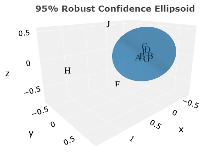

# Robust Confidence Ellipsoid

It is a statistical method for outlier detection in a multivariate data set. This repository provides a R function for build it. The R code to reproduce <b>Figure 1</b> is available at <a target='_blank' rel='noopener noreferrer' href='https://statisticalmetrology.shinyapps.io/basicstat/' title='WEB PAGE IN PORTUGUESE'>Estatística Básica</a> (section 9.3).

<b>Figure 1.</b> 95% Robust Confidence Ellipsoid (RCE).

 

# Reference

[1] LEAL, Luiz Henrique da Conceição. <b>Aplicativo web para avaliação de desempenho de laboratórios.</b> 2022. 146f. Tese (Doutorado em Metrologia) – Instituto Nacional de Metrologia, Qualidade e Tecnologia, Duque de Caxias, RJ, 2022. 

[2] Leal LHC, Rocha WFC. A New Approach for Multivariate Data Analysis in Interlaboratory Comparisons Based on Multidimensional Scaling and Robust Confidence Ellipse. <i>J. Braz. Chem. Soc</i>. 2023;34(3):434-440.  <a target='_blank' rel='noopener noreferrer' href='https://jbcs.sbq.org.br/default.asp?ed=336'><code>(Volume 34, Number 3, March 2023)</code></a>

 

# Note

See the <a target='_blank' rel='noopener noreferrer' href='https://github.com/luizleal1974/Robust-Confidence-Ellipsoid/blob/main/Note.pdf'>note</a> about equation 14 of reference [2] mentioned above.

